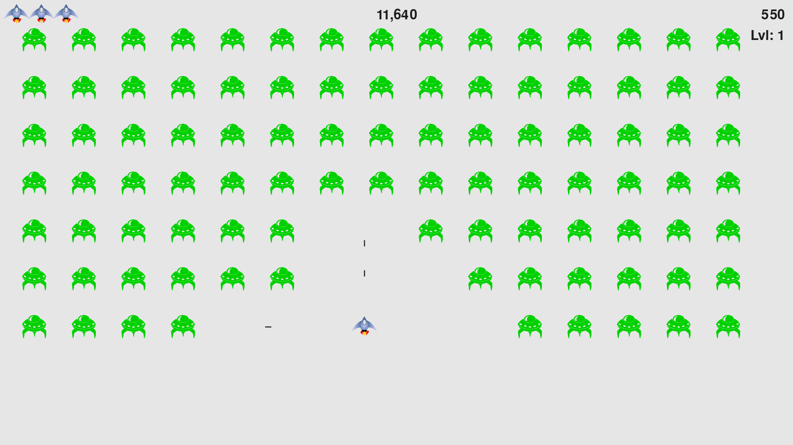

# Alien-Invasion
Using pygame, a collection of fun, powerful 
Python modules that manage graphics,animation, 
etc I created a 2D game. 



## Explanation and Rules

- In Alien Invasion, the player controls a rocket ship that appears
at the bottom center of the screen. 

- Start the game by clicking on the *Play* button or pressing the `P`
 key and quit the game by pressing the `Q` key.

- The player can move the ship right and left:left_right_arrow:, and
up and down:arrow_up_down: using the arrow keys and shoot bullets 
using the `spacebar`, `X` and `Z` keys. 

- When the game begins, a fleet of aliens fills the sky
and moves across and down the screen. The player shoots and
destroys the aliens. 

- If the player shoots all the aliens, a new fleet appears that 
moves faster than the previous fleet. 

- If any alien hits the player’s ship or reaches the bottom of the screen, the player
loses a ship. If the player loses three ships, the game ends.

- The game keeps record of the high score in a file.

## Install
  - ### Requirements
    - [python](https://www.python.org/downloads/)
    - [pygame](https://riptutorial.com/pygame/example/16814/installing-pygame)
    
  - Having installed the requirements, run the game by going to 
  the game path with terminal and:
  > For Mac and Linux:
  ```
        python3 alien_invasion.py
  ```
  > For Windows:
  ```
        python3 alien_invasion.py
  ```
  
